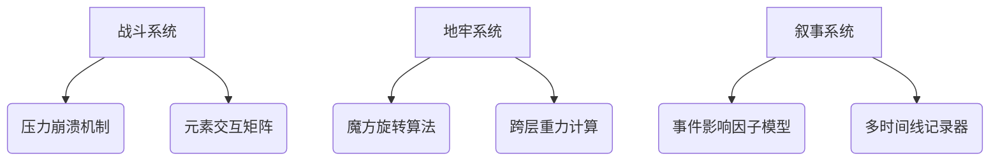

# 《坚果地牢》
**许可证**：CC BY-NC-SA 4.0  
**项目主页**：[Github](https://github.com/Liweimin0512/godot_nut_dungeon) | [Gitee](https://gitee.com/) | [itch.io](https://godot-li.itch.io/godot-nut-dungeon)  

---

## 一、项目愿景
**打造首款社区驱动的暗黑坚果朋克Roguelike**  
通过开源协作构建可持续进化的地牢世界，收益的40%将用于：  
- 维护"老李游戏学院"知识星球  
- 设立社区贡献奖金池  
- 支持独立游戏开发奖学金  

---

## 二、世界观架构
### 1. 核心矛盾
**松鼠王的永生阴谋** vs **坚果文明的自我觉醒**  
- 表面叙事：夺回被乌鸦抢走的"永恒果核"  
- 深层真相：所有坚果都是世界树培育的"活体种子"  

### 2. 势力阵营
| 阵营 | 代表角色 | 终极目标 | 黑色幽默设定 |  
|------|----------|----------|--------------|  
| 教会坚果 | 核桃大主教 | 通过发芽获得神性 | 每周日强迫进行光合作用 |  
| 机械松鼠 | 发条工程师 | 将生物转化为齿轮 | 用橡子壳伪造金币 |  
| 真菌共生体 | 蘑菇贤者 | 建立菌丝神经网络 | 认为下雨是天空在吐孢子 |  

### 3. 地标设定
- **哭泣琥珀洞窟**：封印着因恐惧发芽而自我石化的古代坚果  
- **永动仓鼠轮要塞**：由焦虑症松鼠建造的防御工事  
- **逆生长实验室**：试图通过霉菌实现年龄回溯的疯狂设施  

---

## 三、核心机制
### 1. 三位一体系统
| 模块 | 基础框架 | 扩展接口 | 社区创作指引 |  
|------|----------|----------|--------------|  
| **窒息战斗** | 压力槽+部位破坏 | 自定义崩溃行为树 | 需保持坚果生理特征 |  
| **魔方地牢** | 六边形旋转引擎 | 新环境危害模组 | 禁止出现现实宗教符号 |  
| **动态叙事** | 事件量子化框架 | 故事原子提交规范 | 必须包含黑色幽默要素 |  

### 2. 已实现原型

---

## 四、开发路线图
### 2023里程碑
| 季度 | 目标 | 社区协作重点 |  
|------|------|--------------|  
| Q3 | 核心循环验证版 | 征集100种坚果崩溃行为 |  
| Q4 | 叙事系统α版 | 收集黑色幽默事件剧本 |  

### 2024里程碑
| 季度 | 目标 | 开放接口 |  
|------|------|----------|  
| Q1 | 完整战役模式 | 地牢魔方编辑器Beta |  
| Q2 | 创意工坊支持 | 叙事逻辑可视化工具 |  

---

## 五、社区协作规则
### 1. 内容提交规范
- **美术资源**：必须采用16色索引像素画格式  
- **叙事事件**：需包含至少3个影响因子参数  
- **程序模块**：遵循ECS架构与Lua热重载规范  

### 2. 收益分配原则
| 贡献类型 | 收益分成 | 权益证明 |  
|----------|----------|----------|  
| 核心机制 | 5%永久分成 | NFT贡献凭证 |  
| 优质内容 | 3%版本分成 | 开发者徽章 |  
| BUG修复 | 1%季度分成 | 代码指纹记录 |  

---

## 六、灵感溯源
### 1. 经典重构
| 机制 | 参考作品 | 坚果化改造 |  
|------|----------|------------|  
| 压力系统 | 黑暗地牢 | 盐渍值+果壳裂纹可视化 |  
| 地牢结构 | 方块地牢 | 可旋转六边形蜂巢结构 |  
| 叙事生成 | 漫野奇谭 | 果核基因传承系统 |  

### 2. 创新突破
- **物理模拟叙事**：角色死亡时迸射的果仁将永久改变地牢生态  
- **跨次元存档**：Steam存档可与现实坚果扫描件产生互动  

---

## 七、参与方式
1. 提交**Pull Request**至Github/Gitee仓库  
2. 在知识星球**#坚果设计大赛#** 话题发布方案  
3. 通过itch.io页面的**模块化提交工具**上传内容  

> **特别警示**：所有提交内容不得包含以下元素：  
> - 现实政治隐喻  
> - 未授权IP要素  
> - 加密货币推广  

---

**让我们共同培育这个会发芽的游戏世界！**  
项目监督委员会邮箱：nutdungeon@opensource.game  

---

该文档采用Markdown格式编写，同步发布时建议添加以下增强元素：  
1. 在Github仓库添加`CONTRIBUTING.md`详细指引  
2. 知识星球版本可插入原型开发视频  
3. itch.io页面整合试玩版下载与创意工坊入口  
4. 仓库issues区设置标准化模板（BUG报告/机制提案/叙事投稿）